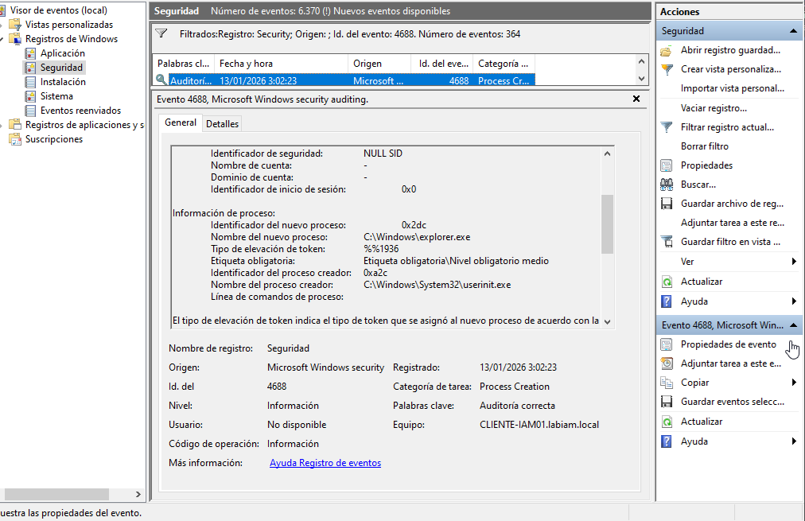
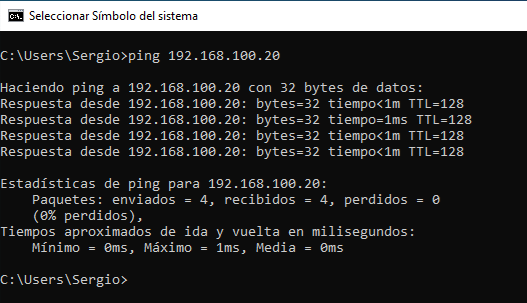
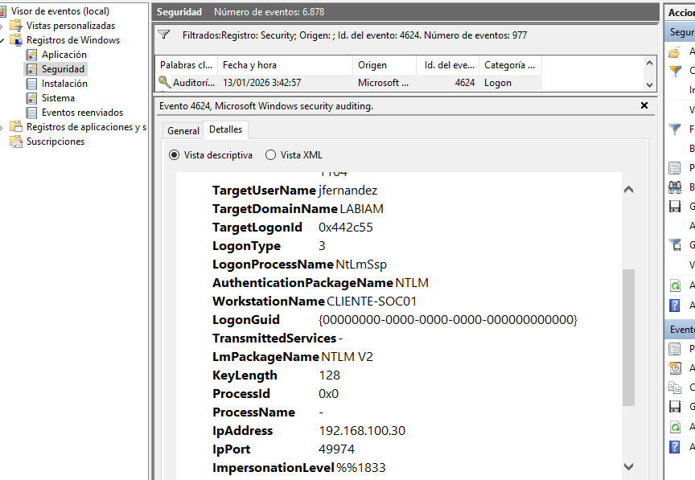

# SOC Lab 04 – Movimiento Lateral / Lateral Movement (Analytical Case Study)

---

## 🇪🇸 Versión en Español

---

## Descripción general

Este laboratorio forma parte de mi **Progressive SOC Track**, una serie de labs conectados cuyo objetivo es mostrar la evolución de un incidente de seguridad desde el punto de vista defensivo.

En este punto del recorrido, el foco ya no está en obtener acceso inicial, sino en **detectar cómo un atacante se mueve lateralmente dentro del entorno utilizando credenciales válidas**, sin generar ruido evidente ni actividad interactiva visible.

El lab se centra en **análisis de logs y razonamiento SOC**, no en técnicas ofensivas.

---

## Posición dentro de la historia SOC

Este laboratorio continúa la secuencia iniciada en:

• `soc-lab-01-iam` – Identidad y control de accesos  
• `soc-lab-02-endpoint` – Análisis de actividad en endpoint  
• `soc-lab-03-persistence-analysis` – Persistencia y mantenimiento de acceso  

SOC Lab 04 analiza el siguiente paso lógico: **el desplazamiento lateral dentro del entorno**.

---

## Objetivo del laboratorio

El objetivo de este lab es desarrollar criterio defensivo para:

• Definir un **baseline de actividad legítima**.  
• Identificar **autenticaciones remotas sin uso interactivo asociado**.  
• Comprender por qué la **ausencia de eventos** puede ser una señal relevante.  
• Analizar patrones completos en lugar de eventos aislados.  
• Pensar como un analista SOC.

---

## Entorno de trabajo

El laboratorio se desarrolla en un entorno Windows con Active Directory.

• Host SOC (origen): `LAB-SOC-CL01`  
• Host objetivo: `CLIENTE-IAM01`  
• Usuario: cuenta de dominio estándar  

Se utilizan exclusivamente herramientas nativas del sistema, principalmente el **Visor de eventos de Windows**.

---

## Actividad legítima y baseline

En primer lugar, se genera actividad normal de un usuario en su equipo habitual.  
Esta actividad incluye inicio de sesión interactivo, uso real del sistema y cierre de sesión.

A partir de esta actividad se construye un **baseline**, que define cómo se comporta un usuario humano cuando utiliza el sistema de forma legítima.

Como parte de esta fase, se observa la creación de procesos asociados a uso humano del sistema.

Este patrón sirve como referencia para identificar desviaciones en fases posteriores.

---

## Reconocimiento sin credenciales

Desde el host SOC se realiza una comprobación básica de conectividad hacia el host objetivo **sin autenticación**.

Esta acción representa reconocimiento previo y no genera eventos de inicio de sesión ni actividad interactiva en el sistema objetivo.

---

## Movimiento lateral técnico

A continuación, se produce un acceso remoto autenticado desde el host SOC hacia el host objetivo utilizando credenciales válidas.

Este acceso se caracteriza por:

• Autenticación de red correcta.  
• Ausencia de sesión interactiva.  
• Ausencia de uso humano del sistema.  

El movimiento lateral se realiza de forma puntual y sin ejecución visible de procesos en el host objetivo.

---

## Evidencia del evento anómalo

En el host objetivo se analizan los registros de seguridad generados tras el acceso remoto.

Se observa un evento de inicio de sesión de red válido (**Logon Type 3**), procedente del host SOC, sin actividad interactiva asociada.

La anomalía no reside en un evento aislado, sino en la **ruptura del patrón esperado** definido en el baseline legítimo.

---

## Conclusión SOC

El análisis demuestra que una autenticación válida **sin actividad interactiva posterior**, en contraste con el patrón normal de uso del usuario, es indicativa de **movimiento lateral técnico**.

Este tipo de comportamiento puede pasar desapercibido si el análisis se limita a eventos individuales y no se evalúa el contexto completo.

---

## Conclusiones finales

Este laboratorio pone de manifiesto que:

• El movimiento lateral no siempre genera señales evidentes.  
• La ausencia de eventos puede ser tan relevante como su presencia.  
• El análisis de patrones completos es clave en un entorno SOC.  

El foco del lab está en el **razonamiento defensivo y la interpretación de logs**, no en la ejecución ofensiva.

---

---

## 🇬🇧 English Version

---

## General description

This laboratory is part of my **Progressive SOC Track**, a series of connected labs designed to illustrate the evolution of a security incident from a defensive perspective.

At this stage, the focus is no longer on initial access, but on **detecting lateral movement within the environment using valid credentials**, without generating obvious noise or interactive activity.

The lab emphasizes **log analysis and SOC reasoning**, not offensive techniques.

---

## Position within the SOC storyline

This lab continues the sequence started in:

• `soc-lab-01-iam` – Identity and access control  
• `soc-lab-02-endpoint` – Endpoint activity analysis  
• `soc-lab-03-persistence-analysis` – Persistence and continued access  

SOC Lab 04 focuses on **lateral movement inside the environment**.

---

## Lab objective

The objective of this lab is to develop defensive reasoning to:

• Define a **legitimate activity baseline**.  
• Identify **remote authentications without interactive usage**.  
• Understand why the **absence of events** can be meaningful.  
• Analyze full patterns instead of isolated events.  
• Think like a SOC analyst.

---

## Environment

The lab is conducted in a Windows Active Directory environment.

• SOC host (source): `LAB-SOC-CL01`  
• Target host: `CLIENTE-IAM01`  
• User: standard domain account  

Only native system tools are used, primarily the **Windows Event Viewer**.

---

## Legitimate activity and baseline

First, normal user activity is generated on the user’s regular workstation.  
This activity includes interactive logon, real system usage and logoff.

From this activity, a **baseline** is established, defining expected human behavior.

This baseline is later used as a reference to detect anomalies.

---

## Credential-less reconnaissance

From the SOC host, a basic connectivity check to the target host is performed **without authentication**.

This phase represents preliminary reconnaissance and does not generate authentication events.

---

## Technical lateral movement

An authenticated remote access is performed from the SOC host to the target host using valid credentials.

This access is characterized by:

• Successful network authentication.  
• No interactive session.  
• No human system usage.  

---

## Anomalous event evidence

On the target host, security logs generated by the remote access are analyzed.

A valid **Logon Type 3** event is observed, originating from the SOC host, with no subsequent interactive activity.

The anomaly lies in the **break of the expected baseline pattern**.

---

## SOC conclusion

The presence of a valid authentication **without subsequent interactive activity**, when contrasted with normal user behavior, is indicative of **technical lateral movement**.

---

## Final conclusions

This lab highlights that:

• Lateral movement does not always produce obvious signals.  
• The absence of events can be as important as their presence.  
• Full pattern analysis is essential in a SOC environment.  

The lab prioritizes **defensive reasoning and analytical thinking** over offensive execution.

---

