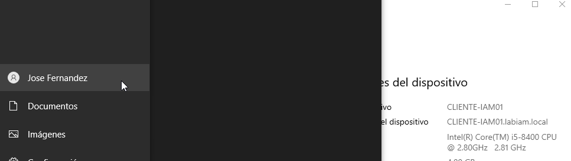
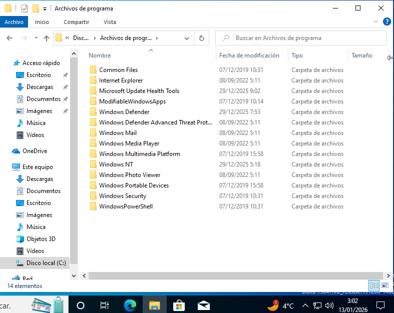
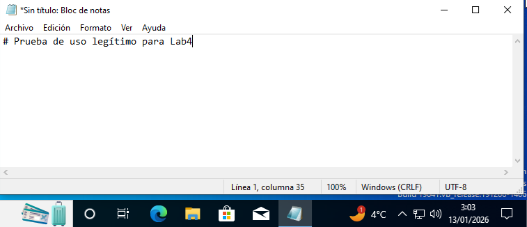
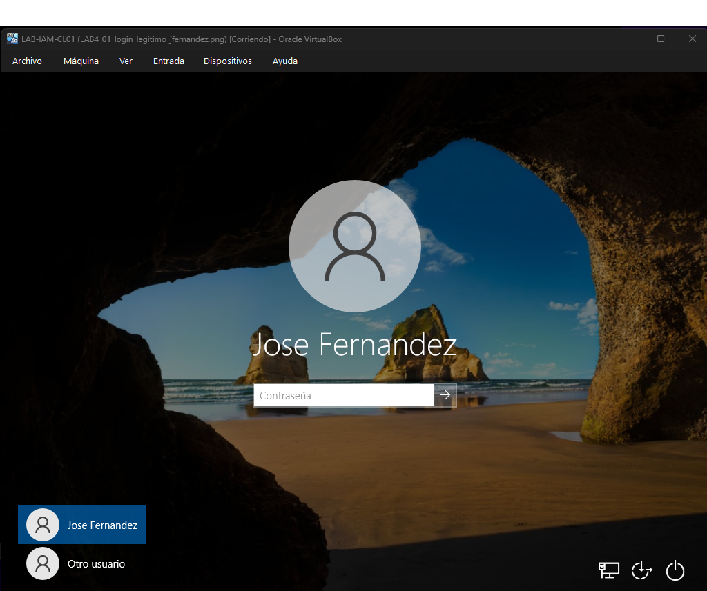
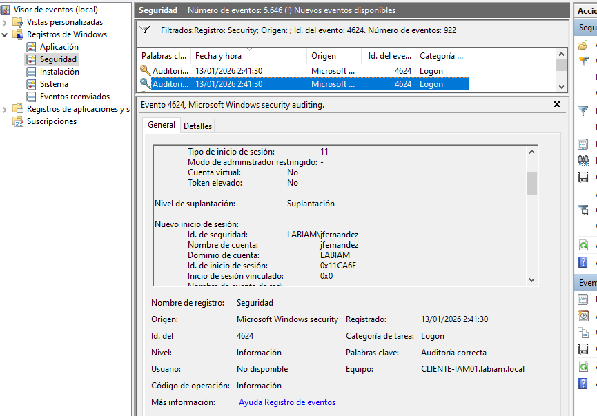
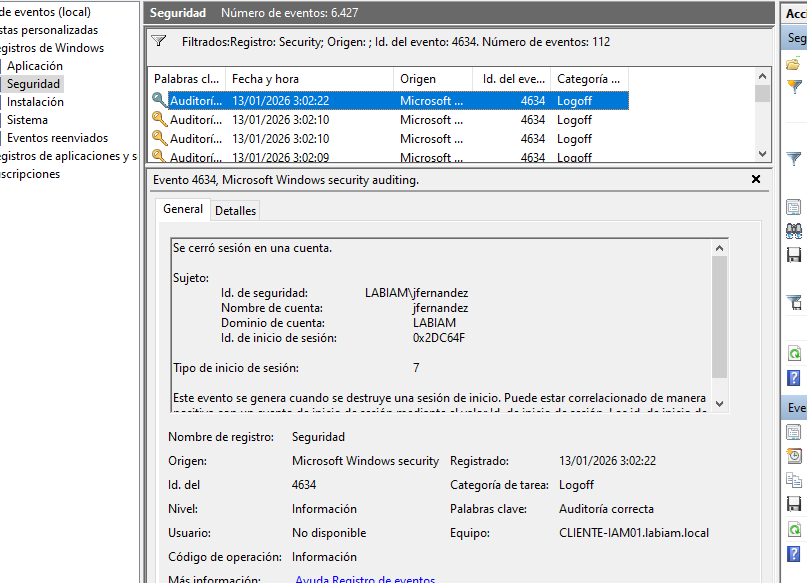
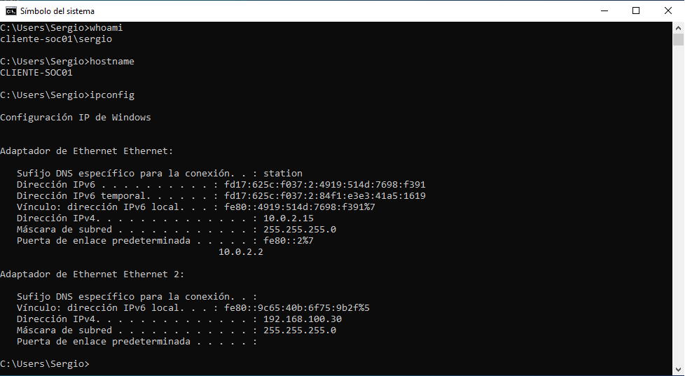
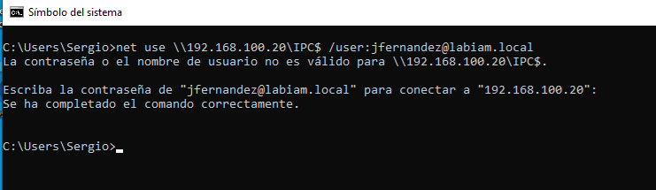

# SOC Lab 04 – Incident Analysis Report

## 🇪🇸 Versión en Español

### Propósito
Este documento complementa el README principal. Recoge la **cronología técnica** y las **evidencias completas** (capturas) utilizadas durante el laboratorio, manteniendo el README como una narrativa de análisis.

---

## Evidencias y cronología

### 1. Actividad legítima (entorno y uso normal)

**Captura 01 - Inicio de sesión legítimo del usuario**  

**Captura 02 - Uso legítimo del sistema – Explorador de archivos**  

**Captura 03 – Actividad legítima (app abierta)**  

**Captura 04 – Logon legítimo (baseline)**  

**Captura 05 - Evento 4624 – Logon legítimo (baseline)**  

**Captura 07 – Logoff legítimo**  

---

### 2. Reconocimiento sin credenciales (referencia)
La evidencia principal de esta fase está incluida en el README.

---

### 3. Movimiento lateral (autenticación aislada)

**Captura 09 – Contexto del host SOC (whoami / hostname / ipconfig)**  

**Captura 10 – Autenticación remota (net use)**  

---

### 4. Evidencia del evento anómalo (referencia)
La evidencia principal del evento 4624 tipo 3 está incluida en el README.

---

## Notas
Este informe documenta evidencias adicionales sin alterar la narrativa principal del README, manteniendo el laboratorio alineado con un enfoque defensivo y analítico.

---

---

## 🇬🇧 English Version

### Purpose
This document complements the main README. It provides the **technical timeline** and **full evidence set** (screenshots) collected during the lab, while keeping the README focused on the analytical narrative.

---

## Evidence and timeline

### 1. Legitimate activity (normal environment and usage)

**Screenshot 01 - Legitimate user logon**  

**Screenshot 02 - Legitimate system usage – File Explorer**  

**Screenshot 03 – Legitimate activity (app open)**  

**Screenshot 04 – Legitimate logon (baseline)**  

**Screenshot 05 - Event 4624 – Legitimate logon (baseline)**  

**Screenshot 07 – Legitimate logoff**  

---

### 2. Credential-less reconnaissance (reference)
The primary evidence for this phase is included in the README.

---

### 3. Lateral movement (isolated authentication)

**Screenshot 09 – SOC host context (whoami / hostname / ipconfig)**  

**Screenshot 10 – Remote authentication (net use)**  

---

### 4. Anomalous event evidence (reference)
The primary evidence for the 4624 Logon Type 3 event is included in the README.

---

## Notes
This report documents additional evidence without disrupting the main README narrative, keeping the lab aligned with a defensive and analytical approach.

